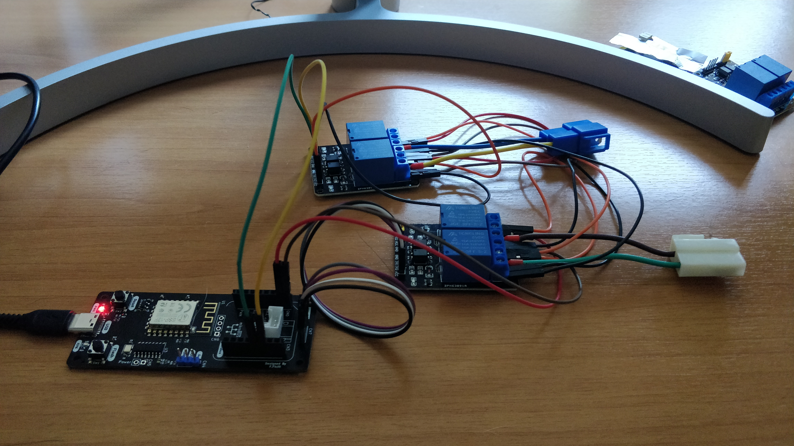

# MartaMobile
Public repo which contains the project of the remote control for my nephew's car.

# Motivation
My nephew got a mini electric car, that can be also remotely controlled. Unfortunately the remote was broken, so we decided to replace it with a setup able to replicate the functionalities and also capable of being controlled from a smartphone. It's a very basic remote control where you can drive the car forward and backward, right and left. So in the end is just a matter of hang up a couple of relays with a control unit with wifi access (i.e. ESP8266 or 32). The rest is simple software stuff (despite I'm a software guy, for some strage reason I'm still fascinated by HW and consider it more difficult than SW). Is August, is hot and I got nothing to do between two swims, so why not invest a couple of hours on a new electronic project?

# The Car (MartaMobile)
...

# Concept
I recently developed the Ganiemede.E12 (see [this repo](https://github.com/ffich/Ganimede.E12_HW) for HW project and [this repo](https://github.com/ffich/Ganimede) for Software examples). I decied to use this as main control unit, and I needed also a couple of relays, that I easyly found on Amazon here: [MartaMobile Relays](https://www.amazon.it/gp/product/B0796SD7NX/ref=ppx_yo_dt_b_asin_image_o07_s00?ie=UTF8&psc=1). I like to use my own boards, but obviously anybody can replace the Ganimede with any other ESP8266 or ESP32 based boards, few examples:

- [AZ Delivery NodeMCU ESP-12 based](https://www.amazon.it/AZDelivery-NodeMCU-esp8266-esp-12e-gratuito/dp/B074Q2WM1Y/ref=sr_1_13?keywords=esp12&qid=1659974572&sr=8-13)
- [AZ Delivery NodeMCU ESP-32 based](https://www.amazon.it/dp/B071P98VTG/ref=sspa_dk_detail_1?psc=1&pd_rd_i=B071P98VTG&pd_rd_w=Fyefa&content-id=amzn1.sym.12d48e73-d66e-43c0-86ee-3b0c51a58638&pf_rd_p=12d48e73-d66e-43c0-86ee-3b0c51a58638&pf_rd_r=1V0RAX2C7QM50D388AQ8&pd_rd_wg=VqMN0&pd_rd_r=d9290fb6-9ad5-487d-bb0d-7a158a749a9c&s=industrial&sp_csd=d2lkZ2V0TmFtZT1zcF9kZXRhaWw&smid=A1X7QLRQH87QA3&spLa=ZW5jcnlwdGVkUXVhbGlmaWVyPUExWTVHQkxHT1hNMlVBJmVuY3J5cHRlZElkPUEwMjg0NDM5MzU3TUZXVDQwNkJYSiZlbmNyeXB0ZWRBZElkPUEwNTYzODg1MVk3RTA2WkdVOTg3RiZ3aWRnZXROYW1lPXNwX2RldGFpbCZhY3Rpb249Y2xpY2tSZWRpcmVjdCZkb05vdExvZ0NsaWNrPXRydWU=)
- [AZ Delivery D1 Mini](https://www.amazon.it/AZDelivery-D1-ESP8266-12E-gratuito-compatibile/dp/B01N9RXGHY/ref=pd_day0fbt_img_sccl_1/261-2056999-4152023?pd_rd_w=FEfNE&content-id=amzn1.sym.dff01a47-6d77-42b3-876e-ee53b37a92df&pf_rd_p=dff01a47-6d77-42b3-876e-ee53b37a92df&pf_rd_r=7ENAHT5VF8V5AWYKC005&pd_rd_wg=oEk6B&pd_rd_r=3f83d655-a634-436b-9ca2-9a3cd1082bc1&pd_rd_i=B0754N794H&th=1)

Here is a picture of the HW setup:

# SW project
I'm a bit in love with Python in this period, so microPyhton was the obvious choiche for this project. I easily started from one of the Ganimede's Repository examples, in particular [this one](https://github.com/ffich/Ganimede/tree/main/10_Python/040_Wireless/10_ApWebserver), which create a wifi network, start a server and load a webpage. I sliglty modified the HTML and the microPython script to support a second relay, and that's it.

Here is a picture of the resulting webapage:

# Testing
We're about to start the testing phase, I'll post some photos and videos.
